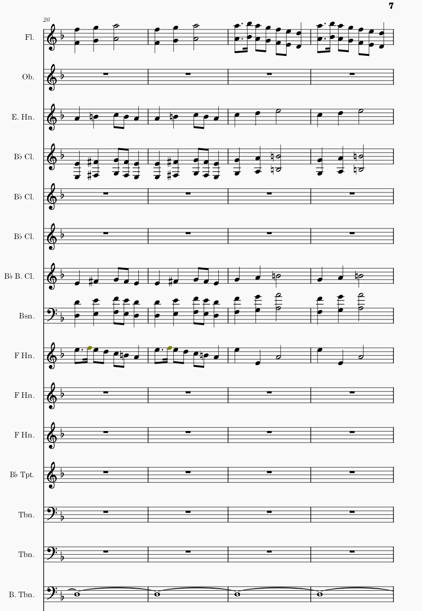

```{r setup, include=FALSE}
knitr::opts_chunk$set(echo = TRUE)
```

## R Markdown


<audio controls>
  <source src="./IMSLP270843-PMLP15427-dso20120512-005-mahler-symphony-no1-mvtI-langsam-schleppend.mp3"type="audio/wav"/>
  </audio>
  
  
  
  
  
  
  
  <h3>asdfasdfasfd</h3>
  
  
  asdfasdfa
  
  
  adfafdasd