```{r setup, include=FALSE}
knitr::opts_chunk$set(echo = TRUE)
```


In order to read scores, there are some important skills you need: 

- The ability to read notes on different clefs. These should include Bass, Treble, Alto, Soprano and Tenor clef
- The ability to tranpose parts on an orchestral score. As an example of this, many scores will have a Clarinet in Bb part on a score. This means for each note you see written in this part, you will need to transpose the written note down a major second to get the note that will be sounded. 

## Clefs

Many people will know how to read notes on the Treble and Bass staff. The others are not as common so these are listed below:

<b>Note names on Soprano, Alto and Tenor Clefs</b>

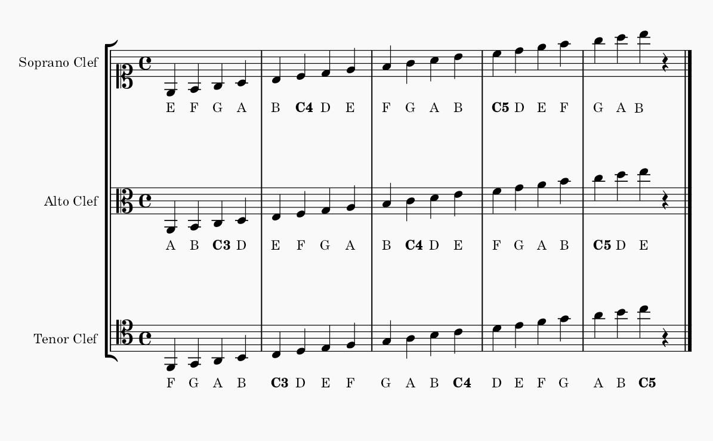</img>

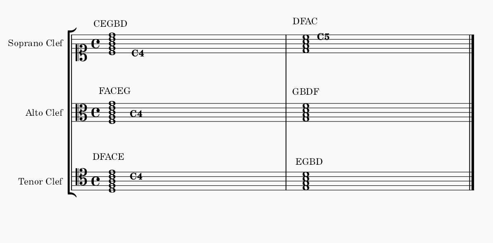</img>

There are different approaches you can use to to learn the clefs. I have found what works best is: 
 
- Writing notes on blank manuscipt until they become second nature
- Looking through any sheet music and imagining that parts use a certain clef and calling out the notes


<b>Note names on ledger lines of Soprano, Alto and Tenor Clefs </b>

Don't forget that, like Bass and Treble clef, these clefs may use ledger lines and you shold note these notes at sight also. Use the strategies above with a focus on the ledger lines

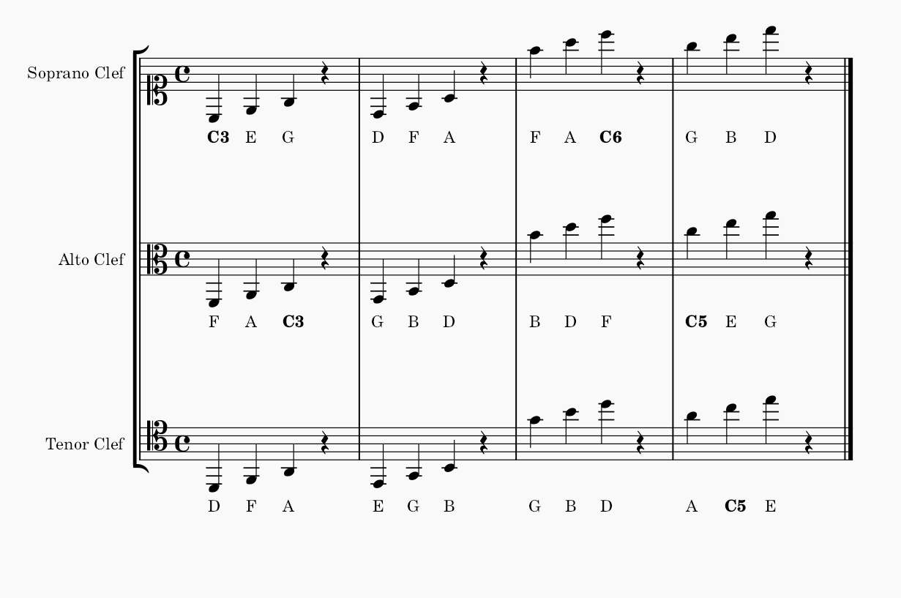</img>


Note that transposition affects mostly Wind and Brass family instruments. There is a complicated history around why we have transposing instruments. There are lots of arguments about this kind of thing, but it really just relates to convenience to allow players to move between instruments and play parts at sight more easily. 


# Transposing Instruments


There are two issues to contend with when it comes to transposing instruments: 

1. When you encounter a note of a transposing instrument written on a score, you will need to transpose this note in order to find out the concert pitch is being played. For example, a C4-Note played on a Bb Clarinet will sound a major second lower, a Bb3-Note; a C5-Note played on an Alto Flute (a transposing instrument in the key of G) will result in a concert note that is a perfect fourth lower, a G4-Note. To read scores effectively, you need to be able to quickly transpose notes to understand which concert pitch they are. 

2. As a consequence of this different key signatures will appear in a scores. Suppose that you want the Clarinet player to play the notes G-F-E in a score that has a key of C Major played. To do this, you need to write all notes a major second higher, A-G-F#. To avoid the need to put in accidentals, you can change the key signature to D Major. The clarinet player will read this as written and provide the passage sounding in C Major

This list below should be memorised. You should know the instrument name, the concert note that is sounded when a C-Note is played, the transposition that you need to make when reading a score. Ideally, you should also be aware that these instruments have notes in different registers and there can be challenges moving between registers and this should be taken into account when writting for these instruments. More details of this coming in a later notebook.  develop recognition of each instruments transposed registers and concert ranges


# CHART HERE

## Strategies for specific transposing instruments

There are some different strategics or tricks that can make it easier, depending on what key your transposing instrument is in. 

<b>Transposing Instruments in Bb</b>

Most common 

B = Bb on german scores


<b>Transposing Instruments in A</b>


Note that transposing instruments in A are generally rarer than those in Bb, but they will still certainly appear in many different scores of (such as Debussy, Strauss, Holst, Belioz, Mendelssohn) Examples of instruments in A include: 

- Clarinet in A 
- Bass Clarinet in A
- Oboe D'amore (A) 
- Cornet in A (Belioz) 
- Horn in A (Mendlesson)

All you need to do is, when you see a note written for these instruments, transpose it down a minor third to get the sounding note. An excellent starting point to study is Beethoven's Symphony 7 in A Major. The Clarinet part has a key signature of C Major so is easier to read. Other tips are: 


- <b>Transposing sharps:</b> <br/>
All sharps become sharps a minor 3rd lower, except E#, A# B#, which become double sharps a minor third lower

- <b>Transposing flats:</b> <br/> 
All flats become flats a minor 3rd lower, Eb Ab, Bb which become naturals a minor 3rd lower

- <b>Reading the Bass clarinet in A</b><br/>
Note that this is scored in the bass clef. You can imagine you are reading the treble clef but down two octaves. 

Details on different registers of instruments in A are as follows: 

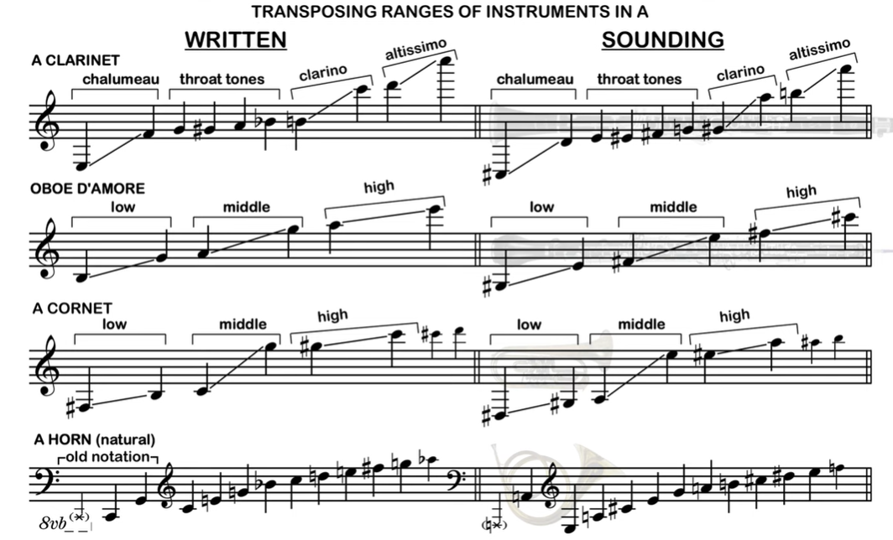</img>

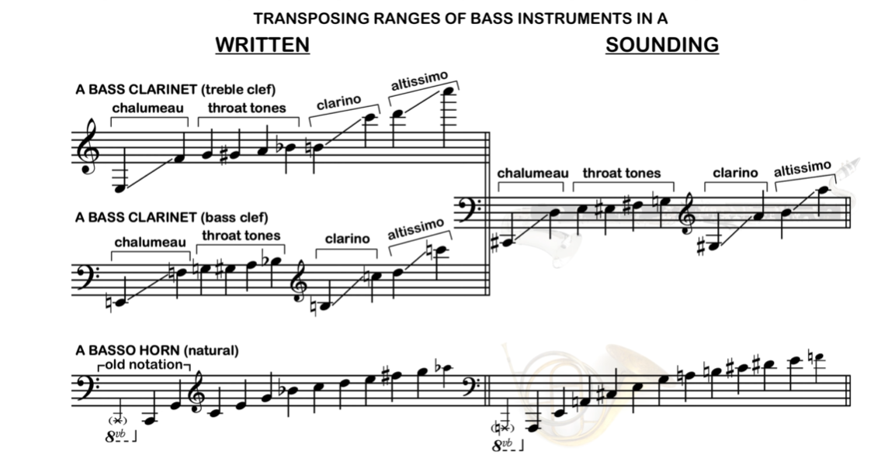</img>

<b>Transposing Instruments in Eb</b>

IN learning to read Eb clarinet and trumpet parts, try the base clef trick for immedient reference, and associate the transposition with each instrument's register and range. Then apply a similiar approach to lower Eb instruments like alto saxophone and contralo clarinet  (Goss)

Eb parts in Ravel (Piano Concerto in G, M3), Holst, MOoside suite for Brass Band, M2 soprano Eb Cornet, Stravinksy Rite of Spring part 2, hyden trumpet concerto in Eb

Note 4 different ranges
Sopranino - Eb Clarinet, Eb Sopranino Saxophone, Eb Piccolo Trumpet, Eb Soprano Cornet - simliar strings in register. Note these sound up a minor third

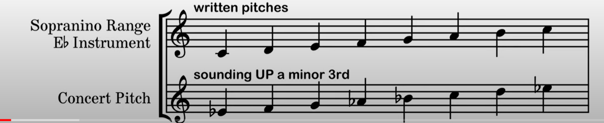</img>


Pitched an octave lower - alto range of Eb instruments

Alto Clarinet in Eb
Alto Saxophone in Eb
Alto Horn in Eb, Tenor Horn (similiar to Tuba look)
Eb Bass Trumpet (Alto Trumpet)
Horn in Eb

note that these end up being an octave below sopranino

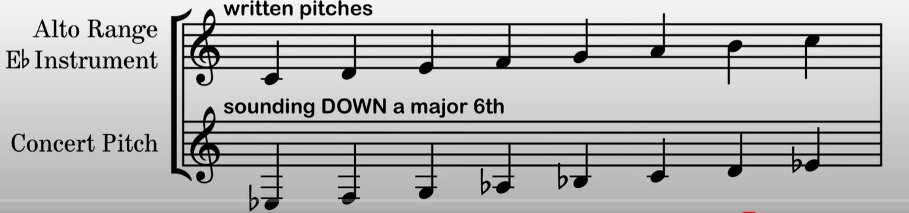</img>


Bass/Baritone Eb Instrtuments

- Contra-alto clarinet in Eb
- Baritone saxohpone in Eb
- Eb Bass Tuba (British brass bands)

middle register -  


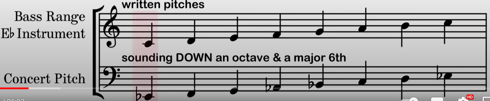</img>


Then contrabass Eb instruments

- Eb Contrabass Saxophone
- Eb Tubax

down to lowest eb on a piano

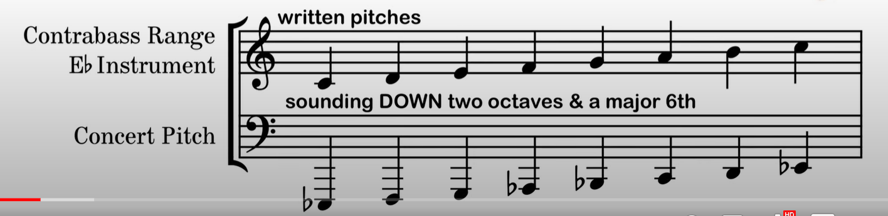</img>

Trick imagine it is bass clef - nice simpicity. 

Then if it isoppranino - put an imaginearry 15v to transpose up to octaves


If alto - imagine 8v higher 

FI bass - nothing needed, except assume it is in bass clef 

Contrabsse - imagine 8v lower


Also need key adjustment, and take care of registers....
You need to add imaginarry base, clear, imaginary key signature, imaginary quindecessemo line 

what about accidentals....

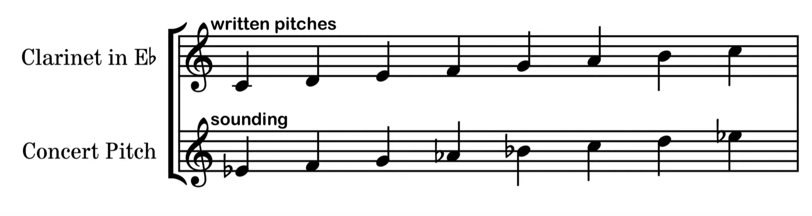</img>


All sharps will be sharps in concert, all flats translate as flats...esxcept for C, F G, sharps as naturals, flats as double flats

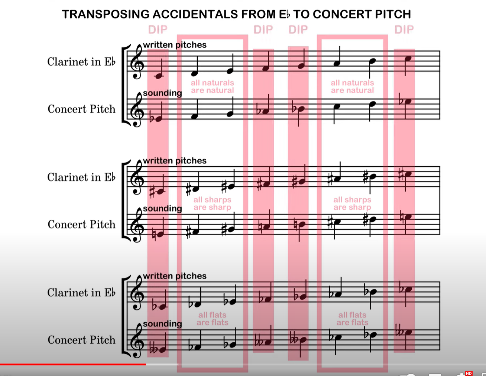</img>


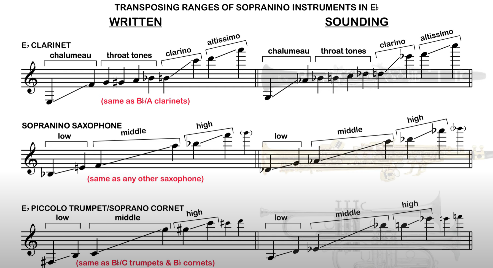</img>


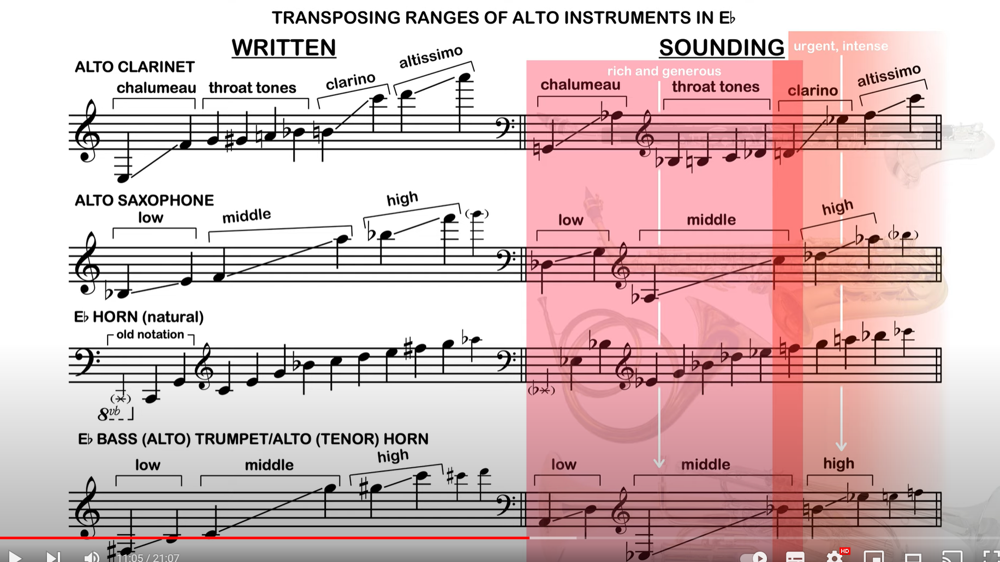</img> 


contralto alto really popular in early soundtracks


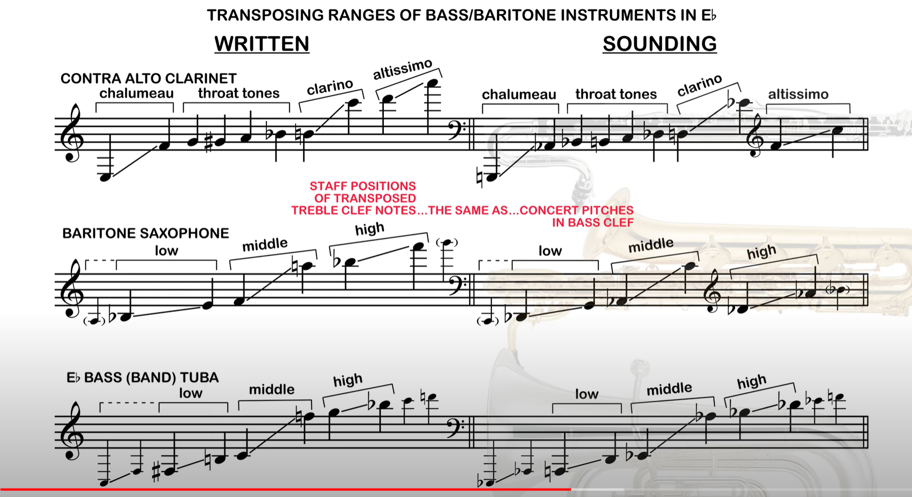</img>


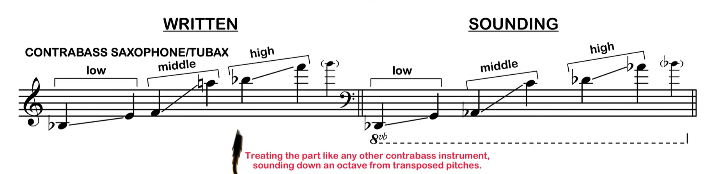</img>

Bizet - example, alto  Andante moderato con moto Bizets second la lisiense swuite L'Arlesienne Suite 2


### Transposing Brass


Horns - no values, just harm series originally playable - 

different lengths of tubing called crooks to lower pitch - pitch harm series in different keys

classical composer might have 2 horns in 2 keys.....


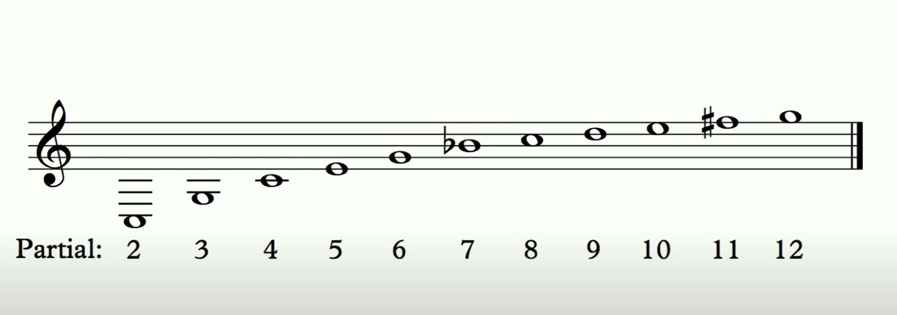</img>


Note in key Eb, not that many pitches available


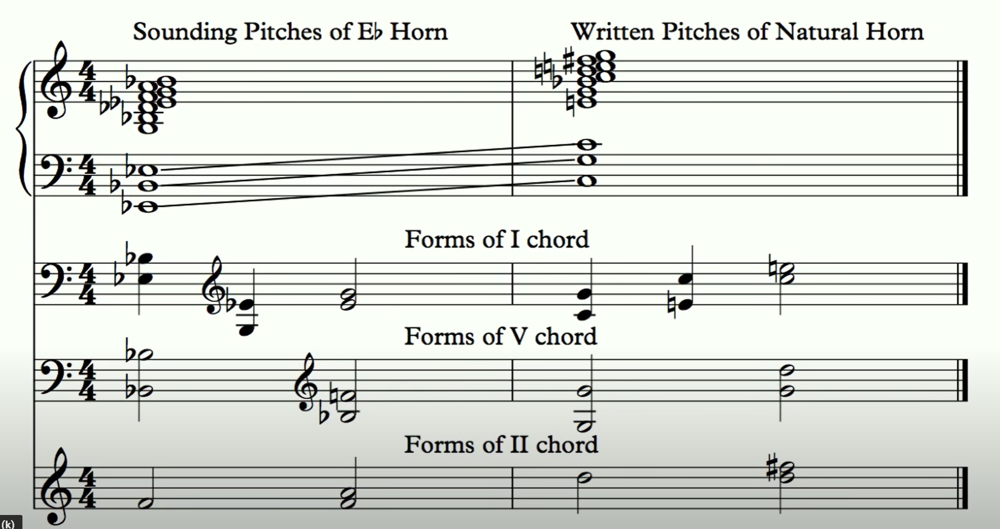</img>


Score-read the following works, transposing horn and trumpet parts:
Beethoven Symphony No. 5, Movt. II
Haydn Symphony No. 100, Movts I & IV
Mozart Symphony No. 39, Movt. 1
Beethoven Symphony No. 6, complete (especially Movt. 5)
...and for a bonus, also try the very fun Haydn Symphony No. 22, "The Philosopher"


Nat trumpets used crooks, note cant play low C of the - use same principle for horns

later scores - using chromatic horns.....eg Tchai Symp 4 - any note can be played
