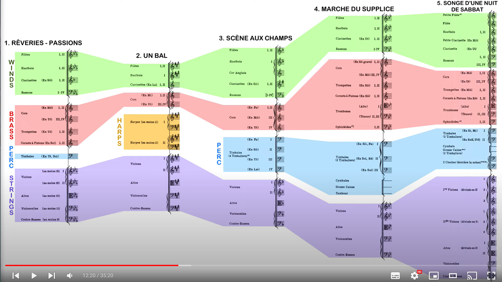

```{r setup, include=FALSE}
knitr::opts_chunk$set(echo = TRUE)


```


following beethoven, shubert and webern....

1830

modern orhcestration came from hree- watch tilson tomas 
- cornerstone of modern orchestration 
- is programatic work
- obsessed by object of desire - each momement
 -- 1st momemvent - ideal
- 2nd movement, meeting at ball
-- 3rd in fields listening
-- 4th movement - murder and mayhem
- finale witches sabbath - this made it shocking at the time
-- note idee fix runs through the whole thing - this is beginning of program music. 
- form - 
-- MVMT 1 - Sonta Allegra
-- MVMT2 2 - Scherzo
-- MVMT 3 - Adagio (Beethoven's 6th)
-- mVMT - March movment -0 like Beethoven also
-- m 5 - fully evolvs into rondo


### Instrumentation

- lots of change, materials, sizes etc changing
- berlioz uses natural horms/trumpets - but also uses cornets with pistons to get chromatic
- also note appearance of guest soloists - expansive solos, helped establish instruments more so in sndards

- note also its really playable comapred to other instruments - not as much need for period practice

Also idea of using subests of players - went fuirther than beethoven, idea of soundscape for each movment: 

</img>


firs movement: 

- 2 flutes, 2nd doubling picollo
- 2 oboes
- 2 Bb clarinets
- 4 Bassons - sometimes unison, somes 2/2 - common in french 19th Century orchestras

- 4 Horns (2 in Eb, 2 in C)
- Tumpets
- Cornets a pisons in G
- Timpany

- strints
- 15 first and 15 second
- 10 violas
- 11 Cellos
- 9 Contrabasses

In berlioz day, string players hard to get, so 

Note this is quite similiar to 17/15/13/11/9
or 18/16/14/12/10 or 16/14/12/10/8

note string scoring depended on this sound of full ensemble, would have been very innnovative in the 1830s


### Second movment instrumentions

2 flutes
1 oboe (artists voice)
2 clarinents in A to allow simple fingering
4 horns - 2 in E 2 in C

4 hamrps in doubled paris - on ly this movement - balanced with other instruments - difficult to find parts, doesn't depend on any specific model of harp


### 3rd movment....
- first big english horn apparnce in moden simp
- note horn choosing of parts here allows lots o freedome
- note ambigous use of timpanies


### 4th momvment - 
bigger - more concerastive 
- Berlioz writing for instruements - trombone Bb/A issue
- note ophicleide, preceded modern Tuba
### 


#### Fith movement 


NO real key relationships are in plaay! - choice of keys and insttruments that work best for keys....instrument depend on key choice. 


Vid 2

M1 - yearhing for love of life

Strart by orchestration

- 2 flutes, 2nd doubling picollo
- 2 oboes
- 2 Bb clarinets
- 4 Bassons - sometimes unison, somes 2/2 - common in french 19th Century orchestras, romantic french scoring

- 4 Natural Horns (2 in Eb, 2 in C) - Eb sound down a major sixth, C horns transpose down an octave (simliarf to bass oboe)
- Tumpets in C - key of C
- Cornets a pisons in G
- Timpani in C and G (older tuning mechanisms) - key of C is important

- strints
- 15 first and 15 second
- 10 violas
- 11 Cellos
- 9 Contrabasses


TIP - Eb Horn soun

- Simliar to mozart G minor symph - horns in different keys to allow lots of chords without pistons
- Note voicing of chord in C2, similar to weber, later beethoven, later hayden, shcubert and not always having 3rd players - classical/early romatinic
- TIP: Dovetailing - chord lasts and first flute takes up some note
- NOTE: mute string chords - 
- Standard effects turned up first in this symphony first. 
- take note of strings - homophony, chordal melody, choral - vs counterpoint
- note where the bowing is
- opening strings melody, written when Berlioz was 11
- note how powerful strings are on thier own. 

- now to bar 11
- note chord at bar 13 - typical romantic voicing 
- at 1 - note V2 pushing beginning of [1] - Second Violins Accent
- Horns and violas octaves  after [1]
- TIP - V1 vs V2 duel   
- TIP - horns and bassoons combo - then add clarinet as part of lower winds
- NOTE - poco rallent pulls back to tempo
- double corde - double stop
- idea of emotion as basis of form - from Schubert and Beethoven
- Schubert critical - emotional freedom

THEN on to rehersal [2]
- so far some modern aspects (mutes, etc) - but now moves to much more innovation - winds so far late clasical Weber, Beethoven
- modern orch stargint ot take place 
- note triple octave C in winds at [2]
- note push from violins - color enforcing - violins enforce flute
- note that natural horn can push down to notes - eg. pushed down G in Eb horn to F# - players at time would have been able to do this
- note Horns 3/4 rarely go outside harmonic series
- note difference - valve horn vs natural horn - nicer tone, tougher internations
- note standard wind accomp - more classical scoring, or triplet chords - but enforcing and appegios in violas/cellos to same middle C, and pizzicato - leads to Schumann, Brahms - wagner/lizt
- hard to tell who Berlioz influenced - he opened the door to everybody
- actual influenced by emotional approach - Tchaikovsk, Scriabin, Rachmaninoff, thought the were quite differnt
- at Bar 28 Tempo 1 - 
- Note Flute clarinet unison, that becomes octave to optimise flute range, which allows violin to flourish
- Note dtnamics p in violin section vs pp in flute/clarinet
- note push from bassons and horns
- strings simple octaves
- note the economy of scooring - mvt can be thought of orchestral prelude
- at bar 31 - simple classical bassons and horns
- note in classical had to choose pitches carefuly
- Bar 34 - octaves liike kearrler 5ths in cellos and doubld bases, balanced with horns
- note unmeasured tremoloin violos and cellos - innovation
- note dotted cresneo marking (editor added) - 
- these would have been new sounds - especially without opera form
- note that overture simimilar to this idea or peer gynt, incidental music idea
- idea that theatre in the mind, visual not needed
- at bar 35 now...
- note strings call and response with different pitches
- bar 38 - call and response becomes harmony in 3rds
- acompanied by standard wind accompaniment - typical of beethoven/mozart - but syncopated with lots of specificatino around duration - with dynamics - 
- note cool wind/horn voicings
- at bar 42 - 
- note strings playing beethoven like offbeats with sforzando - note balance against winds
- delayed resolution in parts (bassoon F# goes to F nat before offbeat strings to do the same)
- note the dynamics in celos/db in bas 45/46 cres-decres with pizz
- leading tone push
- idea of color inbetween idea - bar 29
- note Berlioz really heralds new way of thinking about orchestraion

Next videa  1B: Reh F to J

- Note 6/4 chord on Ab at F
- note call and response 
- pedal note reinterpretion - idea from Beethoven, pedal with reinterpretation
- note Horn solo at F
- note stopped note in horn in pp - don't want to call attention to stop notes
- Now at G
